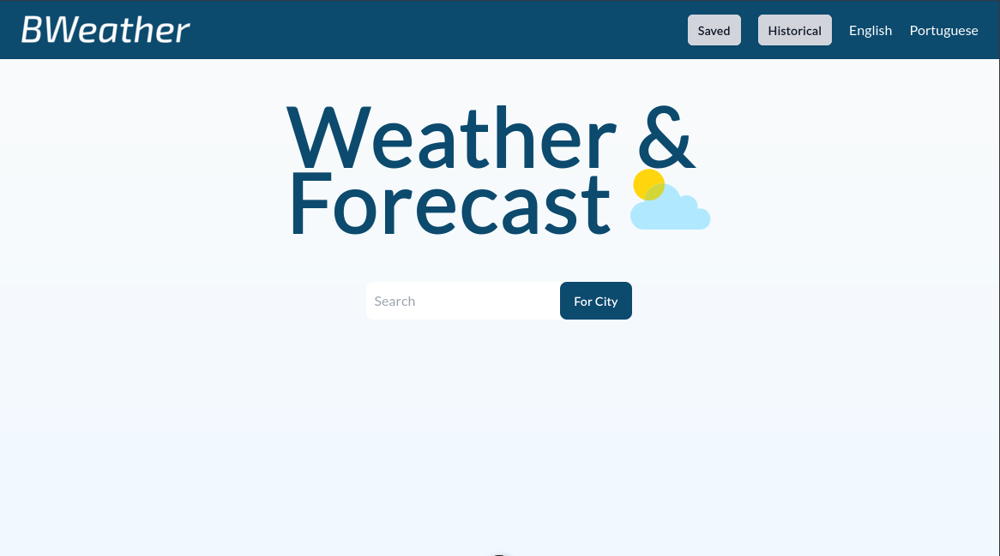
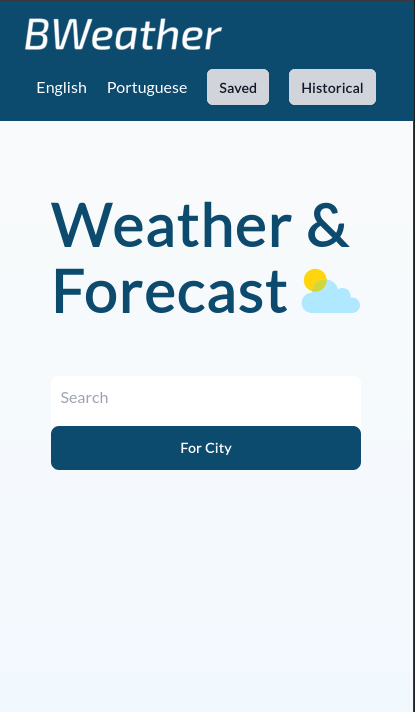
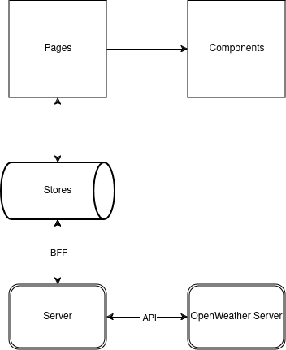

# ☁️ ☀️ BWEATHER

Application for checking weather.




# Goals

- Search weather by city, by current localization or typed
- Show weather information
- Show the historical of searching
- Save favorites
- Show the favorites

# Characters

- [Nuxt 3](https://nuxt.com/docs/getting-started/introduction)
- Vue 3
- TypeScript, JS with strongly type power
- Pinia as state management
- Eslint + Prettier for formatting rules and code quality
- Vitest
- i18n
- Tailwind
- Data source from Openweather
- Github actions

# Getting started

Prerequisites

- node >= 20
- [nvm](https://github.com/nvm-sh/nvm)
- npm

Execute these below commands

```sh
nvm install 22 #from version 20, 22 recommended
nvm use 22
git clone git@github.com:brds15/bbweather
cd bbweather
cp .env.exemple .env # to create env file
npm install # to install dependencies
npm run dev # open localhost:3000
```

# Developing Notes

After analysing the openweather API, I identified two endpoints for

- bringing in time data via coordinates
- discover the coordinates via the location

Analysing all the requirements of the project, I realised that creating two contexts would be enough for the entire implementation of the rules.

- Weather
- Location

The following pages were created

- index - page dedicated to the application's home page, where the location search form is located
- weather - page dedicated to displaying weather information

When I was configuring the tests, I wanted to configure e2e tests. However, vite does not support for cypress. In another hand, I discovered reading the docs, that vitest support e2e tests, and how to configure it.

To create the components, I thought it was important to use atomic design, so

- Atoms -> created for DOM-level components for shared use and free of business rules
- Molecules -> composed of atom components, free of business rules
- Organisms -> did not need to be created at this point in the project's maturity
- Templates -> are components that implement the business logic
- Pages -> made up of templetes. It follows the Nuxt page convention, so it is outside the ‘components’ folder.

Two stores were created for state management

- weather
- location

To integrate with the API, I used the ‘Backend For Frontend’ pattern, thus taking advantage of some of Nuxt's advantages, such as the use of Nitro.
With this, data transformers were created, so that only the necessary fields are formatted and sent to the frontend layer.

To use the cache, I initially thought of using the unstore, but I realised that it wouldn't have any advantages on the frontend side. So I opted to use ‘pinia-plugin-persistedstate’ because of its ease, integration with the store and also with Nuxt3.



## Production

- Deployed by Vercel
- Access: https://bweather.vercel.app/
